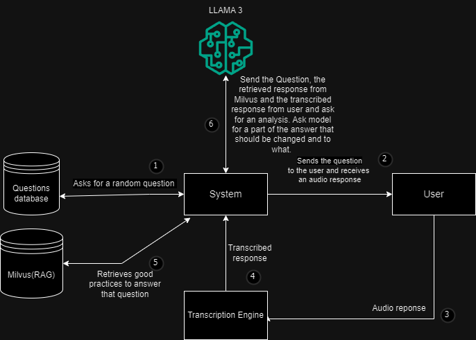

# Prep-Bot

A platform to practice interviews. Prep Bot gives you detailed feedback on how to improve at questions in interviews.

## How to use Prep Bot?

The app asks the user a random question from the collection of questions. The user then is prompted to record a response. The system then transcribes the response, evaluates it and provides feedback on strengths, areas of improvement and suggestions for improvement.

### **In this version to get a new question just refresh the page.**

## Prerequisites

You will need a OpenAI API key for generating embeddings and Groq API Key to access LLama 3 70 b model.

## Motivation ?
I always had trouble coming up with answers on the spot at any interview. One of my seniors told me its best to practice with someone. But I needed someone to practice the interviews with. So I decided to come up with an application of my own. 

## Implementation:

#### Tech Stack:
- LLM: LLama 3 - Groq API
- Database: ChromaDB
- LLM Framework: Langchain
- Frontend: Streamlit
- Backend: Python, Flask

#### Database:
The database contains unstructured data from 301 questions for interview suggested by harvard business school. The is cleaned, chunked and stored in the chromadb vector database. The langchain framework offers a retriever based on text similarity on the chromadb database. We can retrieve the k top similar responses from the database. 
#### Server:
Flask server provides endpoints to get a random question from the database and another endpoint to evaluate thew response.
#### Recording and transcribing the response:
Using the sound device library from python we can record an audio stream, convert it to the required sampling rate and then store it as a tensor. Finally we feed it to the Whisper Tiny Model to get quick yet sufficiently accurate transcription of the answer for evaluation. 
#### Evaluating the response using LLama 3:
Groq Api provides free access to the LLama 3 70b model with 8192 token window. This is free compared to Chatgpt and provides good enough accuracy on responses and limited hallucination. The evalaute endpoint provides the LLama 3 model with:
- context: The randomly selected question and steps to answer it are retrieved from the chromadb and provided to the llama 3 as context.
- template: The template containing instructions on how the response should be structured is given to the model [strengths, areas of improvement, suggestions].
- response: the transcribed response from user is given for evaluation. Using the prompt given above the model then evaluates the user's answer and provides feedback on it.

### Reasons for Choosing the Stack:

1. **LLama 3 via Groq API**:
    - **Cost**: Free access compared to other models like ChatGPT.
    - **Performance**: High accuracy and a large token window, minimizing hallucination and providing reliable responses.
    
2. **ChromaDB**:
    - **Vector Database**: Efficiently handles unstructured data and supports fast similarity searches.
    - **Integration with Langchain**: Seamlessly retrieves similar text responses, enhancing the model's ability to provide relevant answers.
    
3. **Langchain**:
    - **Framework Support**: Simplifies building and integrating retrieval-based AI applications, improving development efficiency.
    
4. **Streamlit**:
    - **Ease of Use**: Facilitates rapid development of interactive web applications, ideal for prototyping and user testing.
    
5. **Python and Flask**:
    - **Flexibility and Community Support**: Well-documented, widely used, and supported, making development and troubleshooting straightforward.
    - **Endpoint Management**: Flask efficiently handles API requests, ensuring smooth server operations.
    
6. **Whisper Tiny Model**:
    - **Speed and Accuracy**: Balances the need for quick transcription with sufficient accuracy for evaluating spoken responses.

## WorkFlow

## Demo

[]
